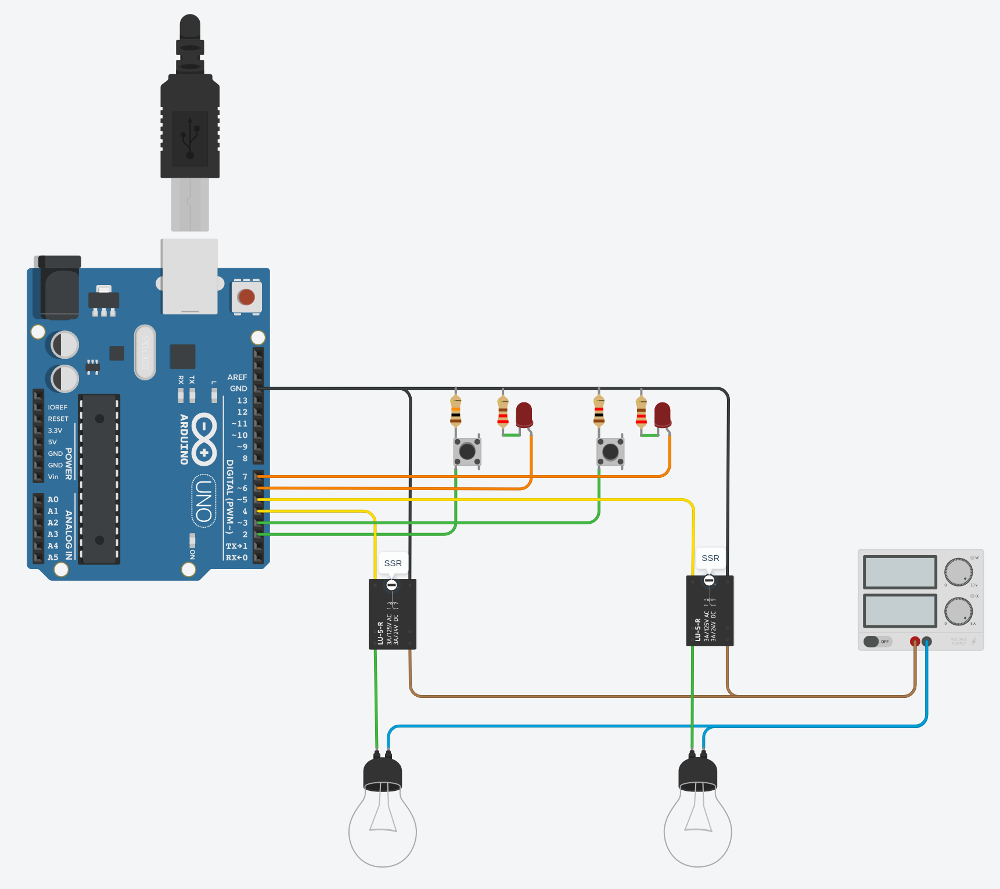

# desk-switch
Small Arduino project to control 2 SSR for my desk (speakers, usb power supply)

Each SSR are totally independent. 

I used push button switch with integrated led.



# usage
When you press on the switch the relay will be activate and the led will light on.
You can switch it off by pressing again and the led will turn off.

after a certain time (5.5h) the led will blink to remember you there is power (30min), if no action is done, it will switch off automatically
But if you press the button when blinking, you will have power of one other 6h.

# adapt to your needs

## define your auto switch off elapse time
```
const unsigned long auto_switch_after_ms = 6*60*60*1000l;
const unsigned long blink_after_ms = 5.5*60*60*1000l;
```
These lines of code will define the timer that it will start to blink and power off.

The origin of the timer is when the button is pressed.

## define your own pins
```
const int ssr1_pin_input = PD2; // switch
const int ssr1_pin_output = PD4;
const int ssr1_led_pin_output = PD6;

const int ssr2_pin_input = PD3; // switch
const int ssr2_pin_output = PD5;
const int ssr2_led_pin_output = PD7;
```

## testing

uncomment the first line of code 
```
//#define __DEBUG__
```
you will get some debug lines on the serial port and very short timer for blink and auto power off.